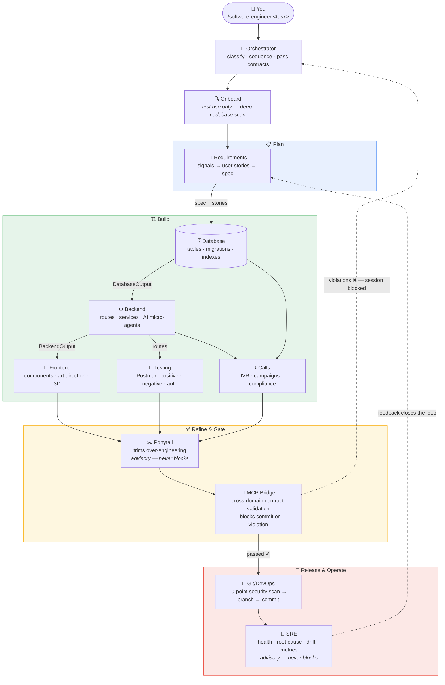
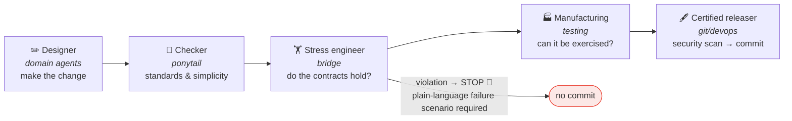
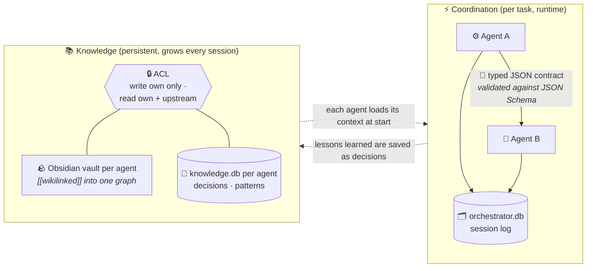

# Software Engineer

A multi-agent system that automates the full software development lifecycle — as a **Claude Code plugin** (the `/software-engineer` command) and as a **cross-IDE MCP server** (Cursor, Windsurf, VS Code, and other MCP editors).

One command. Every agent runs in sequence — requirements spec, database schema, backend routes, frontend components, Postman tests, inbound/outbound call systems, simplification pass, contract validation, security scan, git commit, and a post-release SRE review that feeds the next cycle. Each agent has its own SQLite knowledge base and Obsidian vault that grows smarter with every session.

---

## Install

In Claude Code, register this repo as a plugin marketplace, then install the plugin:

```
/plugin marketplace add MARafey/The-Software-Engineer
/plugin install software-engineer@software-engineer
```

That's it. Run `/software-engineer` — on first use it clones this repo to `~/.agents`, installs dependencies, and seeds the knowledge bases automatically.

> Why a plugin and not a loose file? Claude Code only loads skills that live in a folder as `skills/<name>/SKILL.md`. Dropping a single `software-engineer.md` into `~/.claude/skills/` will **not** register the slash command — the plugin packaging is what makes `/software-engineer` appear.

---

## Usage

```
/software-engineer <task>
```

```
/software-engineer add user authentication with JWT and refresh tokens
/software-engineer fix the broken /api/orders route returning 500
/software-engineer create a products table with categories and inventory
/software-engineer add a dashboard page showing sales statistics
/software-engineer generate Postman tests for all existing routes
/software-engineer add CSP and security headers to the backend
```

Other commands:
```
/software-engineer test         — run 56 health checks, verify install is working (no files modified)
/software-engineer onboard      — force re-scan of current project (auto-runs on first use)
/software-engineer status       — show recent sessions
/software-engineer update       — pull latest version
/software-engineer help         — show all commands
```

---

## Other editors (Cursor, Windsurf, VS Code) — MCP server

Not on Claude Code? The same orchestrator is exposed as an MCP server, so any MCP-capable editor can use it. After the engine is set up (clone + `npm run init` — see *How it works internally*), point the editor at `node ~/.agents/mcp/server.mjs`:

```json
{
  "mcpServers": {
    "software-engineer": { "command": "node", "args": ["~/.agents/mcp/server.mjs"] }
  }
}
```

Tools: `software_engineer_health`, `software_engineer_classify`, and `software_engineer_orchestrate` (plan by default; pass `apply: true` to write files). Reasoning uses the host's model via MCP sampling, or `ANTHROPIC_API_KEY` / `OPENAI_API_KEY` when sampling isn't available — no keys are bundled. Per-editor setup in [`mcp/README.md`](mcp/README.md).

---

## Before building anything, it asks you

Before writing code, the system asks plain-language questions to remove all guesswork:

- **Frontend tasks:** What colors? Top bar or side menu? Mobile-friendly?
- **Backend tasks:** JWT auth or sessions? Rate limiting? API versioning?
- **Database tasks:** Soft delete or hard delete? UUIDs or integers? Expected data size?

For each decision, it shows you its recommendation first and asks if you agree. You can answer all questions at once or just say "use your recommendations" to accept all defaults.

If you share a mockup image or screenshot, it reads it and only asks about the parts that are unclear — not generic "what do you want?" questions.

---

## What happens when you run a task

**First use on any project:** the system automatically scans your entire codebase before doing anything — routes, components, schema, conventions, security posture. This runs once per project and is stored in the agent knowledge bases. Every future session starts with that context already loaded.

The pipeline mirrors the full software delivery lifecycle — requirements → design → build → test → release → operate — with a feedback loop from operations back into requirements:



Frontend, Testing, and Calls run **in parallel** once the backend contract exists.

| Agent | Icon | Does |
|-------|------|------|
| **Requirements** | 📝 | Runs first (spec-driven development). Synthesizes signals — your task, project logs/bug reports, last cycle's SRE feedback — into user stories with Given/When/Then acceptance criteria and a spec whose Decisions table pins every choice the other agents would otherwise guess. Undecidable items come back to you as open questions |
| **Database** | 🗄️ | Writes migration SQL, validates foreign keys, adds indexes |
| **Backend** | ⚙️ | A *data-architect* first plans lean data access — a single shared DB pool, disciplined AI queries (read-only, `LIMIT` + filters, no `SELECT *`), caching/lookup tables — then routes, controllers, services with JSDoc. AI/LLM features follow a full model lifecycle (traceable data, bias checks, fairness evaluation) |
| **Frontend** | 🎨 | Builds components, wires API calls, enforces token/storage rules. Dedicated *layout / positioning / contrast* specialists handle complex parent-child CSS. 3D tasks invoke Opus for scene/physics/shader design |
| **Testing** | 🧪 | Generates Postman collection (positive + negative + auth tests per route), deriving test data from the spec's acceptance criteria |
| **Calls** | 📞 | Inbound IVR flows, outbound dialing campaigns, Twilio/Vonage webhooks, TTS scripts, TCPA/GDPR/DNC compliance |
| **Ponytail** | ✂️ | The "lazy senior dev": reviews the generated code and applies behavior-preserving simplifications — never touching validation, security, or accessibility. Advisory, never blocks |
| **Bridge** | 🌉 | Validates that frontend bindings and telephony webhooks match backend contracts, and that handlers reference real tables. Any blocking violation stops the pipeline before commit |
| **Git/DevOps** | 🔐 | Runs the 10-point security scan, creates a feature branch, writes a Conventional Commit. No force-override exists by design |
| **SRE** | 📡 | Runs last (operate phase): health checks, log/root-cause diagnostics, IaC review, model-drift monitoring, and outcome metrics (coverage, violations — never lines of code). Its feedback is what Requirements reads next session |

### Release sign-off — nobody signs their own work

Borrowed from aerospace engineering: a drawing is never released by the person who drew it. Every session passes an independent chain, and each stage verifies its own discipline:



Two rules are absolute: a failed gate **blocks even under schedule pressure** (there is no force flag), and every blocking violation must explain its concrete failure scenario in plain language — a known risk poorly explained counts as a sign-off failure.

---

## Security rules (enforced before every commit)

The git agent blocks commits that contain:

- `.env` files
- Hardcoded API keys, passwords, or secrets
- Raw JWT/bearer tokens in source
- `localhost` URLs in non-test files
- Auth tokens read from `localStorage`
- Database credentials in `.js` or `.json`

---

## Knowledge bases

Each agent builds up its own Obsidian-compatible knowledge vault at `~/.agents/agents/<name>/vault/`.

```
~/.agents/agents/orchestrator/vault/  Routing, dependency order, per-task session history
~/.agents/agents/requirements/vault/  Specs, user stories, signal-synthesis playbooks
~/.agents/agents/backend/vault/       Express patterns, security rules, AI model lifecycle, route decisions
~/.agents/agents/frontend/vault/      Design tokens, storage rules, 3D scene patterns, component library
~/.agents/agents/database/vault/      Schemas, migrations, query optimization notes
~/.agents/agents/testing/vault/       Postman collections, test reports
~/.agents/agents/calls/vault/         IVR flows, campaign patterns, TTS scripts, TCPA/GDPR compliance
~/.agents/agents/ponytail/vault/      Minimal-code philosophy, review history
~/.agents/agents/gitdevops/vault/     Branch strategy, secure-by-design principles, scan results
~/.agents/agents/mcpbridge/vault/     Contract validation history, release sign-off discipline
~/.agents/agents/sre/vault/           Root-cause runbooks, drift monitoring, outcome metrics
```

### See the whole graph

The vaults are cross-linked with Obsidian `[[wikilinks]]`. To navigate the system as one
connected knowledge graph, **open the `~/.agents/agents/` folder itself as a single Obsidian vault**
(not an individual agent folder). You'll get:

- an **orchestrator** hub note linking to every domain agent, plus the dependency order;
- a **home note per agent** showing what it reads from (upstream), hands off to (downstream), and is validated by;
- **sub-agent** notes wired into each domain's internal pipeline (e.g. `flow-planner → route-creator → …`);
- **per-task session notes** the orchestrator writes in real time as work runs.

Open Obsidian's Graph View to see the agents and their contract flow as a live map.

---

## Requirements

- [Claude Code](https://claude.ai/code) — CLI or IDE extension
- [Node.js](https://nodejs.org) 18 or later
- [Git](https://git-scm.com)
- [Obsidian](https://obsidian.md) *(optional — for browsing agent knowledge bases)*

---

## How it works internally

You install the plugin once (see above). Everything else is handled automatically:

1. First `/software-engineer` invocation → skill clones this repo to `~/.agents/`
2. `npm install` fetches `better-sqlite3`, `uuid`, `chalk`, `ajv`, `@modelcontextprotocol/sdk`
3. `node init/bootstrap.js` creates all SQLite databases and contract schemas
4. `node init/seed-vaults.js` writes the initial Obsidian vault notes
5. All future runs go straight to the orchestration workflow

### How the agents talk to each other

There are two separate layers — runtime coordination and persistent knowledge — and they never mix:



- **Coordination:** each workflow returns a typed JSON contract (`shared/contracts/*.schema.json`) that the next agent consumes — e.g. frontend binds only to routes the backend actually declared. The bridge agent blocks the git commit if any frontend↔backend or backend↔database contract is inconsistent.
- **Knowledge:** each agent owns an Obsidian vault + SQLite `knowledge.db`. Access is scoped — an agent writes only its own knowledge and reads only its own plus its upstream dependencies (the SRE and validation agents read everything). Database queries from agents are read-only and result-capped so they can't balloon context.

---

## Updating

```
/software-engineer update
```

Or manually:
```bash
cd ~/.agents && git pull origin master && npm install && node init/bootstrap.js && node init/verify.js
```
